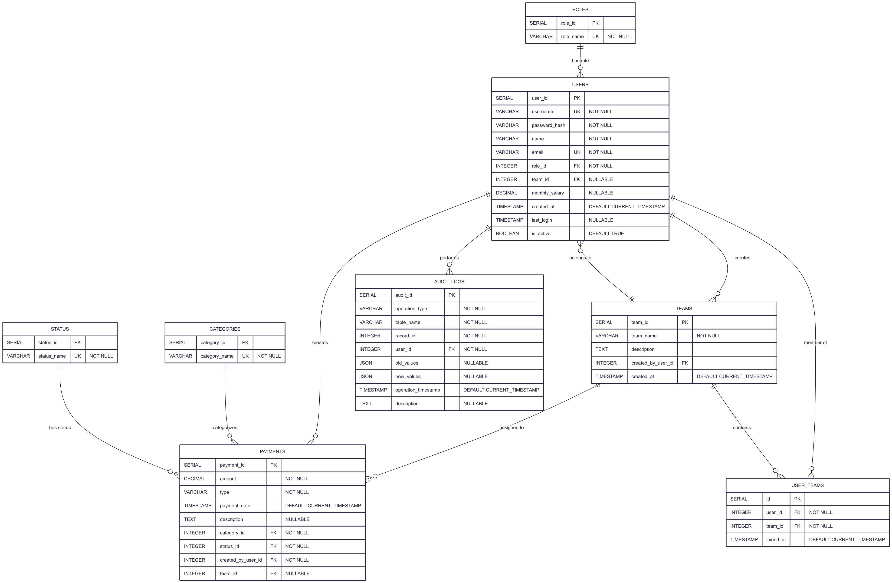
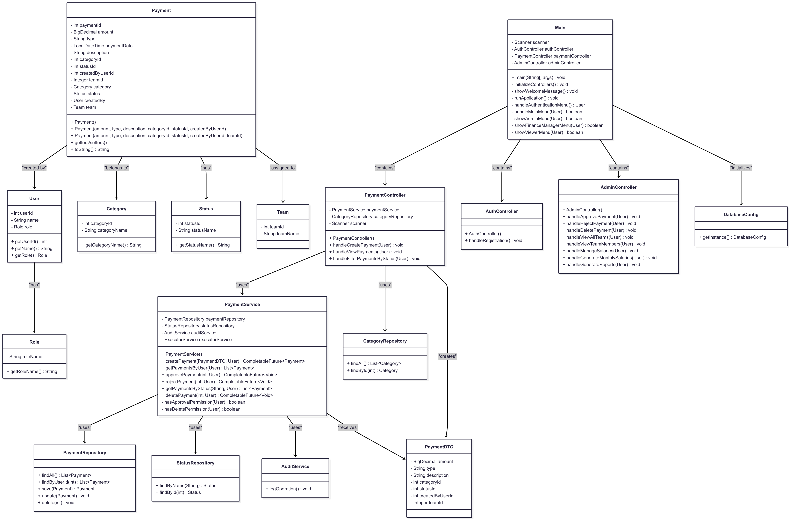

# Payment Management System

A comprehensive Java-based payment management system with role-based access control, audit trails, and real-time payment processing capabilities.

## 🏗️ System Architecture

The system follows a layered architecture pattern with clear separation of concerns:

- **Presentation Layer**: Console-based user interface with menu-driven navigation
- **Controller Layer**: Handles user interactions and orchestrates business operations
- **Service Layer**: Contains business logic and asynchronous processing
- **Repository Layer**: Data access abstraction with PostgreSQL integration
- **Model Layer**: Domain entities representing business objects

## 🚀 Features

### Core Functionality
- ✅ **Payment Creation & Management**: Create, view, and manage payments with categorization
- ✅ **Role-Based Access Control**: Admin, Finance Manager, and Viewer roles with specific permissions
- ✅ **Payment Approval Workflow**: Three-state workflow (Pending → Approved/Rejected)
- ✅ **Team Management**: Create teams and assign users for organizational structure
- ✅ **Audit Trail**: Complete logging of all operations for compliance
- ✅ **Salary Management**: Automated monthly salary generation for employees

### Advanced Features
- ⚡ **Asynchronous Processing**: Non-blocking operations using CompletableFuture
- 🔐 **Secure Authentication**: BCrypt password hashing with session management
- 📊 **Reporting System**: Monthly and quarterly financial reports
- 🔍 **Payment Filtering**: Filter payments by status, user, date, and category
- 🏢 **Multi-tenant Support**: Team-based payment organization

## 🛠️ Technology Stack

| Component | Technology |
|-----------|------------|
| **Language** | Java 17+ |
| **Database** | PostgreSQL |
| **Security** | BCrypt (jBCrypt) |
| **Build Tool** | Maven |
| **Architecture** | Layered Architecture |
| **Concurrency** | CompletableFuture, ExecutorService |

## 📋 Prerequisites

- Java Development Kit (JDK) 17 or higher
- PostgreSQL 12 or higher
- Maven 3.6 or higher
- Git

## 🔧 Installation & Setup

### 1. Clone the Repository
```bash
git clone https://github.com/akhilesh852/Payment-Management-System.git
cd payment-management-system
```
### 2. Configure Database Connection 
Update database configuration in src/main/resources: 
```bash 
db.url=jdbc:postgresql://127.0.0.1/payment_management
db.username=postgres
db.password=<password>
```

## 🎯 Getting Started

### First Time Setup
1. **Start the Application**: Run the main class
2. **Database Initialization**: The system automatically creates tables and default data
3. **Default Admin Login**: 
   - Email: `admin@admin.tech`
   - Password: `admin@123`

### Basic Usage Flow
1. **Login** with admin credentials
2. **Create Users** with appropriate roles
3. **Set up Teams** and assign users
4. **Create Payments** and manage approval workflow
5. **Generate Reports** for financial tracking

## 👥 User Roles & Permissions

| Role | Permissions |
|------|-------------|
| **Admin** | • Full system access
• Create/delete payments
• User management
• Generate reports
• Salary management |
| **Finance Manager** | • Create/approve/reject payments
• Team management
• View all payments
• Generate reports |
| **Viewer** | • View own payments
• Filter personal payments
• Basic payment information access |

## 📊 Database Schema

### Core Tables
- **users**: User accounts with authentication and profile data
- **roles**: System roles (admin, finance_manager, viewer)
- **teams**: Organizational units for payment management
- **payments**: Core payment transactions
- **categories**: Payment classification (Office Supplies, Travel, etc.)
- **status**: Payment workflow states (PENDING, APPROVED, REJECTED)
- **audit_logs**: Complete audit trail for compliance

## Entity Relationships



## Class Diagram



## 📁 Project Structure

```
src/main/java/org/paymentmanagementsystem/
├── Main.java                           # Application entry point
├── config/
│   └── DatabaseConfig.java            # Database configuration
├── controller/
│   ├── AdminController.java           # Admin operations
│   ├── AuthController.java            # Authentication
│   └── PaymentController.java         # Payment operations
├── dto/
│   ├── LoginRequestDTO.java           # Login data transfer
│   ├── PaymentDTO.java               # Payment data transfer
│   └── UserDTO.java                  # User data transfer
├── exception/
│   ├── AuthenticationException.java   # Auth exceptions
│   ├── AuthorizationException.java    # Authorization exceptions
│   └── PaymentException.java         # Payment exceptions
├── model/
│   ├── Category.java                 # Payment categories
│   ├── Payment.java                  # Core payment entity
│   ├── Role.java                     # User roles
│   ├── Status.java                   # Payment status
│   ├── Team.java                     # Team management
│   └── User.java                     # User accounts
├── repository/
│   ├── CategoryRepository.java        # Category data access
│   ├── PaymentRepository.java        # Payment data access
│   ├── StatusRepository.java         # Status data access
│   ├── TeamRepository.java           # Team data access
│   └── UserRepository.java           # User data access
├── service/
│   ├── AuditService.java             # Audit trail logging
│   ├── AuthService.java              # Authentication logic
│   ├── PaymentService.java           # Payment business logic
│   ├── ReportService.java            # Report generation
│   └── SalaryService.java            # Salary management
└── util/
    ├── DatabaseInitializer.java      # Database setup
    ├── PasswordUtil.java             # Password encryption
    └── ValidationUtil.java           # Input validation
```

 
